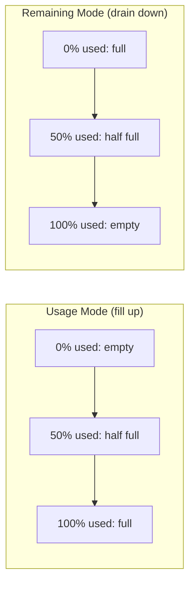

# Project name change to token-juice

**Date**: 2026-02-15

---

### **User**

Okay, please take a look at the project, we need to rename it to token-juice instead of cursor-juice because now we support more than one provider

### **Assistant** `claude-4.6-opus-high-thinking`

[Thinking] The user wants to rename the project from "cursor-juice" to "token-juice". Let me explore the codebase to understand the full scope of changes needed.
Let me explore the project to understand the full scope of the rename.
[Tool: Task]
  subagent_type: explore
  description: Explore project structure and references
  prompt: Explore the project at /Users/lnmunhoz/projects/cursor-juice thoroughly. I need to find ALL references to "cursor-juice" and "cursor juice" and "Cursor Juice" (case-insensitive) across the entire codebase. 

Please:
1. List the full project directory structure
2. Search for all occurrences of "cursor-juice", "cursor juice", "Cursor Juice", "CursorJuice", "cursorJuice" in all files
3. Read package.json to understand the project name and scripts
4. Read any config files that reference the project name (vite.config, tsconfig, etc.)
5. Read the README if it exists
6. Read the main App.tsx and any component files that display the project name in the UI
7. Check the HTML files (index.html) for title/meta tags

Return a comprehensive list of every file and line that contains a reference to "cursor" in the context of the project name (not references to cursor as a CSS property or text cursor).
  model: fast

### **Assistant** `claude-4.6-opus-high-thinking`

Now let me also check the App.tsx for any UI references to the project name, and the assets folder.
[Tool: Read]
  path: /Users/lnmunhoz/projects/cursor-juice/src/App.tsx
  offset: 1
  limit: 30
[Tool: Read]
  path: /Users/lnmunhoz/projects/cursor-juice/src/assets/cursor-logo.svg
[Tool: Grep]
  pattern: cursor-juice|Cursor Juice|CursorJuice|cursorJuice|cursor_juice
  -i: false
  path: /Users/lnmunhoz/projects/cursor-juice/src

### **Assistant** `claude-4.6-opus-high-thinking`

[Tool: Grep]
  pattern: Cursor Juice|cursor.juice|cursorJuice
  -i: true
  path: /Users/lnmunhoz/projects/cursor-juice/src
[Tool: Read]
  path: /Users/lnmunhoz/projects/cursor-juice/src-tauri/tauri.conf.json
[Tool: Read]
  path: /Users/lnmunhoz/projects/cursor-juice/src-tauri/Cargo.toml

### **Assistant** `claude-4.6-opus-high-thinking`

[Tool: Read]
  path: /Users/lnmunhoz/projects/cursor-juice/package.json
[Tool: Read]
  path: /Users/lnmunhoz/projects/cursor-juice/index.html
[Tool: Read]
  path: /Users/lnmunhoz/projects/cursor-juice/src-tauri/src/main.rs

### **Assistant** `claude-4.6-opus-high-thinking`

Now let me check the log prefixes in `lib.rs` to understand the pattern used there.
[Tool: Grep]
  pattern: \[cursor-juice\]|cursor.juice|Cursor Juice|cursor_juice
  path: /Users/lnmunhoz/projects/cursor-juice/src-tauri/src/lib.rs
  output_mode: count
[Tool: Read]
  path: /Users/lnmunhoz/projects/cursor-juice/src-tauri/src/lib.rs
  offset: 1200
  limit: 70
[Tool: Read]
  path: /Users/lnmunhoz/projects/cursor-juice/src-tauri/src/lib.rs
  offset: 170
  limit: 10

### **Assistant** `claude-4.6-opus-high-thinking`

I now have a comprehensive understanding of all the changes needed. Let me create the plan.
[Tool: CreatePlan]
  name: Rename to Token Juice
  overview: Rename the project from "cursor-juice" to "token-juice" across all configuration files, Rust source code, and HTML -- covering package names, display names, log prefixes, config directory paths, identifiers, and Cargo crate names.
  plan: # Rename Project from "Cursor Juice" to "Token Juice"

## Scope

57 occurrences in `lib.rs` plus references in 6 other files. The frontend `src/` directory has **no** text references to the project name (only an SVG asset import for the Cursor logo, which stays since Cursor is still a supported provider).

## Files to Change

### 1. [package.json](package.json)
- Line 2: `"name": "cursor-juice"` -> `"name": "token-juice"`

### 2. [index.html](index.html)
- Line 6: `<title>Cursor Juice</title>` -> `<title>Token Juice</title>`

### 3. [src-tauri/tauri.conf.json](src-tauri/tauri.conf.json)
- Line 3: `"productName": "Cursor Juice"` -> `"productName": "Token Juice"`
- Line 5: `"identifier": "com.cursorjuice.app"` -> `"identifier": "com.tokenjuice.app"`
- Line 17: `"title": "Cursor Juice"` -> `"title": "Token Juice"`

### 4. [src-tauri/Cargo.toml](src-tauri/Cargo.toml)
- Line 2: `name = "cursor-juice"` -> `name = "token-juice"`
- Line 14: `name = "cursor_juice_lib"` -> `name = "token_juice_lib"`

### 5. [src-tauri/src/main.rs](src-tauri/src/main.rs)
- Line 5: `cursor_juice_lib::run()` -> `token_juice_lib::run()`

### 6. [src-tauri/src/lib.rs](src-tauri/src/lib.rs) (57 occurrences)
- **Config directory path** (line 173): `.join("cursor-juice")` -> `.join("token-juice")`
- **All `[cursor-juice]` log prefixes** (~53 occurrences): `[cursor-juice]` -> `[token-juice]`
- **Menu items** (lines 1211-1214):
  - `"About Cursor Juice"` -> `"About Token Juice"`
  - `"Quit Cursor Juice"` -> `"Quit Token Juice"`
  - `SubmenuBuilder::new(app, "Cursor Juice")` -> `SubmenuBuilder::new(app, "Token Juice")`

### 7. [src-tauri/Cargo.lock](src-tauri/Cargo.lock) (auto-generated)
- This will be regenerated automatically on next build. No manual edit needed.

## What is NOT changing
- `src/assets/cursor-logo.svg` -- this is the Cursor provider logo, not the app name
- `src/assets/claude-logo.svg` -- provider logo
- Any CSS cursor properties
- The `.cursor/` directory (IDE config, not project-related)

## Migration note
Users who have existing settings stored at `~/.config/cursor-juice/settings.json` will lose them after the rename (new path: `~/.config/token-juice/settings.json`). This is acceptable for a pre-1.0 app.

  todos: [{"id":"rename-package-json","content":"Rename in package.json (name field)"},{"id":"rename-index-html","content":"Rename in index.html (title tag)"},{"id":"rename-tauri-conf","content":"Rename in tauri.conf.json (productName, identifier, title)"},{"id":"rename-cargo-toml","content":"Rename in Cargo.toml (package name, lib name)"},{"id":"rename-main-rs","content":"Rename in main.rs (lib crate reference)"},{"id":"rename-lib-rs","content":"Rename all occurrences in lib.rs (config path, log prefixes, menu items)"}]

### **User**

1|# Rename Project from "Cursor Juice" to "Token Juice"
     2|
     3|## Scope
     4|
     5|57 occurrences in `lib.rs` plus references in 6 other files. The frontend `src/` directory has **no** text references to the project name (only an SVG asset import for the Cursor logo, which stays since Cursor is still a supported provider).
     6|
     7|## Files to Change
     8|
     9|### 1. [package.json](package.json)
    10|
    11|- Line 2: `"name": "cursor-juice"` -> `"name": "token-juice"`
    12|
    13|### 2. [index.html](index.html)
    14|
    15|- Line 6: `<title>Cursor Juice</title>` -> `<title>Token Juice</title>`
    16|
    17|### 3. [src-tauri/tauri.conf.json](src-tauri/tauri.conf.json)
    18|
    19|- Line 3: `"productName": "Cursor Juice"` -> `"productName": "Token Juice"`
    20|- Line 5: `"identifier": "com.cursorjuice.app"` -> `"identifier": "com.tokenjuice.app"`
    21|- Line 17: `"title": "Cursor Juice"` -> `"title": "Token Juice"`
    22|
    23|### 4. [src-tauri/Cargo.toml](src-tauri/Cargo.toml)
    24|
    25|- Line 2: `name = "cursor-juice"` -> `name = "token-juice"`
    26|- Line 14: `name = "cursor_juice_lib"` -> `name = "token_juice_lib"`
    27|
    28|### 5. [src-tauri/src/main.rs](src-tauri/src/main.rs)
    29|
    30|- Line 5: `cursor_juice_lib::run()` -> `token_juice_lib::run()`
    31|
    32|### 6. [src-tauri/src/lib.rs](src-tauri/src/lib.rs) (57 occurrences)
    33|
    34|- **Config directory path** (line 173): `.join("cursor-juice")` -> `.join("token-juice")`
    35|- **All `[cursor-juice]` log prefixes** (~53 occurrences): `[cursor-juice]` -> `[token-juice]`
    36|- **Menu items** (lines 1211-1214):
    37|  - `"About Cursor Juice"` -> `"About Token Juice"`
    38|  - `"Quit Cursor Juice"` -> `"Quit Token Juice"`
    39|  - `SubmenuBuilder::new(app, "Cursor Juice")` -> `SubmenuBuilder::new(app, "Token Juice")`
    40|
    41|### 7. [src-tauri/Cargo.lock](src-tauri/Cargo.lock) (auto-generated)
    42|
    43|- This will be regenerated automatically on next build. No manual edit needed.
    44|
    45|## What is NOT changing
    46|
    47|- `src/assets/cursor-logo.svg` -- this is the Cursor provider logo, not the app name
    48|- `src/assets/claude-logo.svg` -- provider logo
    49|- Any CSS cursor properties
    50|- The `.cursor/` directory (IDE config, not project-related)
    51|
    52|## Migration note
    53|
    54|Users who have existing settings stored at `~/.config/cursor-juice/settings.json` will lose them after the rename (new path: `~/.config/token-juice/settings.json`). This is acceptable for a pre-1.0 app.
    55|


Implement the plan as specified, it is attached for your reference. Do NOT edit the plan file itself.

To-do's from the plan have already been created. Do not create them again. Mark them as in_progress as you work, starting with the first one. Don't stop until you have completed all the to-dos.

### **Assistant** `claude-4.6-opus-high-thinking`

[Thinking] Let me implement the rename plan step by step. I'll start with the simpler config files and work my way to the large lib.rs file.
Let me start implementing the rename. I'll begin with the config files in parallel.
[Tool: TodoWrite]
  todos: [{"id":"rename-package-json","content":"Rename in package.json (name field)","status":"in_progress"},{"id":"rename-index-html","content":"Rename in index.html (title tag)","status":"pending"},{"id":"rename-tauri-conf","content":"Rename in tauri.conf.json (productName, identifier, title)","status":"pending"},{"id":"rename-cargo-toml","content":"Rename in Cargo.toml (package name, lib name)","status":"pending"},{"id":"rename-main-rs","content":"Rename in main.rs (lib crate reference)","status":"pending"},{"id":"rename-lib-rs","content":"Rename all occurrences in lib.rs (config path, log prefixes, menu items)","status":"pending"}]
  merge: true

### **Assistant** `claude-4.6-opus-high-thinking`

[Tool: StrReplace]
  path: /Users/lnmunhoz/projects/cursor-juice/package.json
  old_string: "name": "cursor-juice",
  new_string: "name": "token-juice",
[Tool: StrReplace]
  path: /Users/lnmunhoz/projects/cursor-juice/index.html
  old_string: <title>Cursor Juice</title>
  new_string: <title>Token Juice</title>
[Tool: StrReplace]
  path: /Users/lnmunhoz/projects/cursor-juice/src-tauri/tauri.conf.json
  old_string: "productName": "Cursor Juice",
  new_string: "productName": "Token Juice",
[Tool: StrReplace]
  path: /Users/lnmunhoz/projects/cursor-juice/src-tauri/src/main.rs
  old_string: cursor_juice_lib::run()
  new_string: token_juice_lib::run()

### **Assistant** `claude-4.6-opus-high-thinking`

Now the remaining tauri.conf.json changes and Cargo.toml.
[Tool: TodoWrite]
  todos: [{"id":"rename-package-json","content":"Rename in package.json (name field)","status":"completed"},{"id":"rename-index-html","content":"Rename in index.html (title tag)","status":"completed"},{"id":"rename-main-rs","content":"Rename in main.rs (lib crate reference)","status":"completed"},{"id":"rename-tauri-conf","content":"Rename in tauri.conf.json (productName, identifier, title)","status":"in_progress"}]
  merge: true
[Tool: StrReplace]
  path: /Users/lnmunhoz/projects/cursor-juice/src-tauri/tauri.conf.json
  old_string: "identifier": "com.cursorjuice.app",
  new_string: "identifier": "com.tokenjuice.app",
[Tool: StrReplace]
  path: /Users/lnmunhoz/projects/cursor-juice/src-tauri/tauri.conf.json
  old_string: "title": "Cursor Juice",
  new_string: "title": "Token Juice",
[Tool: StrReplace]
  path: /Users/lnmunhoz/projects/cursor-juice/src-tauri/Cargo.toml
  old_string: name = "cursor-juice"
  new_string: name = "token-juice"
[Tool: StrReplace]
  path: /Users/lnmunhoz/projects/cursor-juice/src-tauri/Cargo.toml
  old_string: name = "cursor_juice_lib"
  new_string: name = "token_juice_lib"

### **Assistant** `claude-4.6-opus-high-thinking`

Good, now the big one -- `lib.rs`. I'll use `replace_all` for the log prefix and then handle the unique strings individually.
[Tool: TodoWrite]
  todos: [{"id":"rename-tauri-conf","content":"Rename in tauri.conf.json (productName, identifier, title)","status":"completed"},{"id":"rename-cargo-toml","content":"Rename in Cargo.toml (package name, lib name)","status":"completed"},{"id":"rename-lib-rs","content":"Rename all occurrences in lib.rs (config path, log prefixes, menu items)","status":"in_progress"}]
  merge: true
[Tool: StrReplace]
  path: /Users/lnmunhoz/projects/cursor-juice/src-tauri/src/lib.rs
  old_string: [cursor-juice]
  new_string: [token-juice]
  replace_all: true

### **Assistant** `claude-4.6-opus-high-thinking`

Now let me handle the remaining unique occurrences in lib.rs: the config directory path and the menu items.
[Tool: StrReplace]
  path: /Users/lnmunhoz/projects/cursor-juice/src-tauri/src/lib.rs
  old_string: .join("cursor-juice");
  new_string: .join("token-juice");
[Tool: StrReplace]
  path: /Users/lnmunhoz/projects/cursor-juice/src-tauri/src/lib.rs
  old_string: "About Cursor Juice"
  new_string: "About Token Juice"
[Tool: StrReplace]
  path: /Users/lnmunhoz/projects/cursor-juice/src-tauri/src/lib.rs
  old_string: "Quit Cursor Juice"
  new_string: "Quit Token Juice"
[Tool: StrReplace]
  path: /Users/lnmunhoz/projects/cursor-juice/src-tauri/src/lib.rs
  old_string: SubmenuBuilder::new(app, "Cursor Juice")
  new_string: SubmenuBuilder::new(app, "Token Juice")

### **Assistant** `claude-4.6-opus-high-thinking`

Now let me verify there are no remaining references to `cursor-juice` or `Cursor Juice` anywhere in the source files.
[Tool: Grep]
  pattern: cursor.juice|Cursor Juice|cursor_juice|CursorJuice|cursorjuice
  -i: false
  path: /Users/lnmunhoz/projects/cursor-juice/src-tauri/src
[Tool: Grep]
  pattern: cursor.juice|Cursor Juice|cursor_juice|CursorJuice|cursorjuice
  -i: false
  path: /Users/lnmunhoz/projects/cursor-juice/package.json
[Tool: Grep]
  pattern: cursor.juice|Cursor Juice|cursor_juice|CursorJuice|cursorjuice
  -i: false
  path: /Users/lnmunhoz/projects/cursor-juice/index.html
[Tool: Grep]
  pattern: cursor.juice|Cursor Juice|cursor_juice|CursorJuice|cursorjuice
  -i: false
  path: /Users/lnmunhoz/projects/cursor-juice/src-tauri/tauri.conf.json
[Tool: Grep]
  pattern: cursor.juice|Cursor Juice|cursor_juice|CursorJuice|cursorjuice
  -i: false
  path: /Users/lnmunhoz/projects/cursor-juice/src-tauri/Cargo.toml

### **Assistant** `claude-4.6-opus-high-thinking`

All clean -- zero remaining references. Let me mark the final todo as complete.
[Tool: TodoWrite]
  todos: [{"id":"rename-lib-rs","content":"Rename all occurrences in lib.rs (config path, log prefixes, menu items)","status":"completed"}]
  merge: true

### **Assistant** `claude-4.6-opus-high-thinking`

All done. Here's a summary of everything that was renamed:

**Config files:**
- `package.json` -- name field changed to `token-juice`
- `index.html` -- page title changed to "Token Juice"
- `src-tauri/tauri.conf.json` -- product name, window title, and app identifier all updated (`com.tokenjuice.app`)
- `src-tauri/Cargo.toml` -- crate name to `token-juice`, lib name to `token_juice_lib`

**Rust source:**
- `src-tauri/src/main.rs` -- updated crate reference to `token_juice_lib::run()`
- `src-tauri/src/lib.rs` -- all 57 occurrences updated: log prefixes (`[token-juice]`), config directory path (`.join("token-juice")`), and menu items ("About Token Juice", "Quit Token Juice", submenu label)

The `Cargo.lock` will regenerate automatically on the next build. Note that the actual workspace directory is still named `cursor-juice` on disk -- you can rename that at the filesystem level whenever you're ready.

### **User**

Okay, and since we renamed it to tokenJuice, I want to change a little bit how the progress bar works, because right now it's like a progress bar from bottom to top, but since it's kind of like the concept of the app is like a juice, it should be like top, bottom, that the progress bar kind of like goes down as the usage increases, so we know how much percentage we use. But maybe this could be an option the user chooses to see like the left percentage of or the current percentage use or the left percentage use and then if it's the current percentage use we show the progress bar from empty to full and if it's like left percentage use we show from full to then empty. Can be an option in the menu

### **Assistant** `claude-4.6-opus-high-thinking`

Let me explore the current progress bar implementation and the menu/settings system to understand how things work today.
[Tool: Task]
  subagent_type: explore
  description: Explore progress bar and settings
  prompt: Explore the project at /Users/lnmunhoz/projects/cursor-juice thoroughly. I need to understand:

1. How the progress bar currently works in the UI. Read `src/App.tsx` fully and find all code related to progress bars, percentage calculations, and how the fill/height is determined. Pay special attention to how `percentUsed` or similar values drive the visual bar.

2. How the CSS styles the progress bar. Read `src/App.css` fully and find all styles related to the progress bar fill, height, animations, and direction (bottom-to-top vs top-to-bottom).

3. How the settings/menu system works. Look in `src-tauri/src/lib.rs` for:
   - The `Settings` struct definition
   - How settings are serialized/loaded/saved
   - How menu items are created (especially the CheckMenuItem pattern)
   - How settings changes are emitted to the frontend
   - How the frontend listens to settings changes

4. How the frontend receives and uses settings from the backend.

Return ALL relevant code snippets with line numbers for each of these areas.
  model: fast

### **Assistant** `claude-4.6-opus-high-thinking`

[Thinking] Now I have a very thorough understanding of how the progress bar and settings system work. Let me create a plan for the user.

The user wants:
1. Change the progress bar direction concept:
   - Currently: bottom-to-top, showing "used" percentage
   - Option A: "Used" mode - bar fills from empty to full (bottom-to-top, current behavior)
   - Option B: "Remaining" mode - bar starts full and drains (top-to-bottom, "juice draining" concept)
   
2. This should be a menu option the user can toggle

Let me think about the implementation:


For the "remaining" mode, I'd calculate the fill as `100 - percentUsed` to show what's left, anchor the bar at the top instead of the bottom so it drains downward, and toggle between these two display modes based on a user setting. Remaining" (juice concept)** - Shows how much is left
- Bar starts full and drains as usage increases
- 0% used = full bar (100% juice), 100% used = empty bar (no juice)
- `fill = 100 - percentUsed`
- Bar should anchor from TOP so it visually "drains" downward

For the CSS:
- Current: `.bar-fill` has `bottom: 0` (anchored to bottom, fills upward)
- "Remaining" mode: `.bar-fill` should have `top: 0` instead of `bottom: 0` (anchored to top, drains downward)

For the settings:
- Add a new setting to the Settings struct in Rust: something like `display_mode` which can be "used" or "remaining"
- Add a menu item for it
- Pass it to the frontend

The frontend will then use this setting to decide how to calculate the fill percentage and which CSS class to apply.
I have a clear picture of the current implementation. Let me put together a plan.
[Tool: CreatePlan]
  name: Progress bar display mode
  overview: Add a "Display Mode" setting that lets the user choose between showing "Usage" (bar fills up as tokens are consumed, current behavior) or "Remaining" (bar starts full and drains down like juice being consumed). The mode is toggled via the app menu and persisted in settings.
  plan: # Progress Bar Display Mode (Usage vs Remaining)

## Concept

Two modes controlled by a new setting:

- **"Usage" mode** (current behavior): Bar fills bottom-to-top as usage increases. 0% used = empty, 100% used = full.
- **"Remaining" mode** (juice draining): Bar starts full at the top and drains downward. 0% used = full bar, 100% used = empty bar. This matches the "juice" metaphor -- you see the juice level drop as you consume tokens.



## Changes

### 1. Backend: Settings struct and menu -- [src-tauri/src/lib.rs](src-tauri/src/lib.rs)

**Settings struct** (~line 85): Add a new field `display_mode: String` with values `"usage"` or `"remaining"`, defaulting to `"remaining"` (the juice metaphor is the whole point of the app).

```rust
pub struct Settings {
    pub show_plan: bool,
    pub show_on_demand: bool,
    pub show_claude_window: bool,
    pub display_mode: String, // "usage" or "remaining"
}
```

Default:
```rust
display_mode: "remaining".to_string(),
```

**Menu items** (~line 1198): Add a new `CheckMenuItemBuilder` for the display mode. A checked state means "Remaining" mode is active, unchecked means "Usage" mode:

```rust
let remaining_mode_item =
    CheckMenuItemBuilder::with_id("remaining_mode", "Show Remaining (Juice Mode)")
        .checked(settings.display_mode == "remaining")
        .build(app)?;
```

Insert it in the submenu between the existing visibility toggles and the separator before Quit.

**Menu event handler** (~line 1233): Handle the `"remaining_mode"` event ID -- toggle `display_mode` between `"remaining"` and `"usage"`, save, and emit.

### 2. Frontend: Settings interface -- [src/App.tsx](src/App.tsx)

**Settings interface** (~line 46): Add `displayMode: "usage" | "remaining"`.

**State** (~line 215): Add `const [displayMode, setDisplayMode] = useState<"usage" | "remaining">("remaining")`.

**Settings listener** (~line 337): Read and update `displayMode` from initial fetch and from `settings-changed` events.

### 3. Frontend: Bar fill calculation -- [src/App.tsx](src/App.tsx)

In the `cursorToViewModel` and Claude adapter functions, when building `BarConfig`:

- **Usage mode**: `fill = clampFill(percent)` (current behavior)
- **Remaining mode**: `fill = clampFill(100 - percent)`

The `percent` value on the `BarConfig` stays as the raw usage percent (for tooltip/label purposes), only `fill` changes.

Pass `displayMode` into the adapter functions alongside the other settings.

### 4. Frontend: CSS direction -- [src/App.css](src/App.css)

Currently `.bar-fill` is anchored with `bottom: 0` (fills upward). Add a CSS class `.bar-fill--remaining` that overrides to `top: 0; bottom: auto;` so the fill anchors from the top and visually "drains" downward.

```css
.bar-fill--remaining {
  bottom: auto;
  top: 0;
}
```

Apply this class conditionally in the JSX when `displayMode === "remaining"`.

The shimmer animation direction should also be reversed for remaining mode (sweep downward instead of upward), via a `.bar-fill--remaining.shimmer::after` override that changes the `bottom` keyframes to `top`.

### 5. Color logic consideration

The color thresholds (green at low usage, red at high usage) should stay based on **usage percent** in both modes. When in "remaining" mode, a nearly-empty bar will be red (high usage), which is the correct visual signal.

## Files changed (summary)

| File | What changes |
|------|-------------|
| `src-tauri/src/lib.rs` | `Settings` struct, default, menu item, event handler |
| `src/App.tsx` | `Settings` interface, state, listener, fill calc, CSS class |
| `src/App.css` | `.bar-fill--remaining` class, reversed shimmer |

  todos: [{"id":"backend-settings","content":"Add display_mode field to Settings struct, Default impl, save/load in lib.rs"},{"id":"backend-menu","content":"Add 'Show Remaining (Juice Mode)' CheckMenuItem and wire up the menu event handler in lib.rs"},{"id":"frontend-settings","content":"Update Settings interface, add displayMode state, wire up listener and initial fetch in App.tsx"},{"id":"frontend-fill-calc","content":"Update bar fill calculation in cursorToViewModel and Claude adapter to respect displayMode"},{"id":"frontend-css","content":"Add .bar-fill--remaining CSS class with top-anchor and reversed shimmer, apply conditionally in JSX"}]

### **User**

1|# Progress Bar Display Mode (Usage vs Remaining)
     2|
     3|## Concept
     4|
     5|Two modes controlled by a new setting:
     6|
     7|- **"Usage" mode** (current behavior): Bar fills bottom-to-top as usage increases. 0% used = empty, 100% used = full.
     8|- **"Remaining" mode** (juice draining): Bar starts full at the top and drains downward. 0% used = full bar, 100% used = empty bar. This matches the "juice" metaphor -- you see the juice level drop as you consume tokens.
     9|
    10|```mermaid
    11|graph LR
    12|  subgraph usageMode ["Usage Mode (fill up)"]
    13|    U0["0% used: empty"] --> U50["50% used: half full"] --> U100["100% used: full"]
    14|  end
    15|  subgraph remainingMode ["Remaining Mode (drain down)"]
    16|    R0["0% used: full"] --> R50["50% used: half full"] --> R100["100% used: empty"]
    17|  end
    18|```
    19|
    20|## Changes
    21|
    22|### 1. Backend: Settings struct and menu -- [src-tauri/src/lib.rs](src-tauri/src/lib.rs)
    23|
    24|**Settings struct** (~line 85): Add a new field `display_mode: String` with values `"usage"` or `"remaining"`, defaulting to `"remaining"` (the juice metaphor is the whole point of the app).
    25|
    26|```rust
    27|pub struct Settings {
    28|    pub show_plan: bool,
    29|    pub show_on_demand: bool,
    30|    pub show_claude_window: bool,
    31|    pub display_mode: String, // "usage" or "remaining"
    32|}
    33|```
    34|
    35|Default:
    36|
    37|```rust
    38|display_mode: "remaining".to_string(),
    39|```
    40|
    41|**Menu items** (~line 1198): Add a new `CheckMenuItemBuilder` for the display mode. A checked state means "Remaining" mode is active, unchecked means "Usage" mode:
    42|
    43|```rust
    44|let remaining_mode_item =
    45|    CheckMenuItemBuilder::with_id("remaining_mode", "Show Remaining (Juice Mode)")
    46|        .checked(settings.display_mode == "remaining")
    47|        .build(app)?;
    48|```
    49|
    50|Insert it in the submenu between the existing visibility toggles and the separator before Quit.
    51|
    52|**Menu event handler** (~line 1233): Handle the `"remaining_mode"` event ID -- toggle `display_mode` between `"remaining"` and `"usage"`, save, and emit.
    53|
    54|### 2. Frontend: Settings interface -- [src/App.tsx](src/App.tsx)
    55|
    56|**Settings interface** (~line 46): Add `displayMode: "usage" | "remaining"`.
    57|
    58|**State** (~line 215): Add `const [displayMode, setDisplayMode] = useState<"usage" | "remaining">("remaining")`.
    59|
    60|**Settings listener** (~line 337): Read and update `displayMode` from initial fetch and from `settings-changed` events.
    61|
    62|### 3. Frontend: Bar fill calculation -- [src/App.tsx](src/App.tsx)
    63|
    64|In the `cursorToViewModel` and Claude adapter functions, when building `BarConfig`:
    65|
    66|- **Usage mode**: `fill = clampFill(percent)` (current behavior)
    67|- **Remaining mode**: `fill = clampFill(100 - percent)`
    68|
    69|The `percent` value on the `BarConfig` stays as the raw usage percent (for tooltip/label purposes), only `fill` changes.
    70|
    71|Pass `displayMode` into the adapter functions alongside the other settings.
    72|
    73|### 4. Frontend: CSS direction -- [src/App.css](src/App.css)
    74|
    75|Currently `.bar-fill` is anchored with `bottom: 0` (fills upward). Add a CSS class `.bar-fill--remaining` that overrides to `top: 0; bottom: auto;` so the fill anchors from the top and visually "drains" downward.
    76|
    77|```css
    78|.bar-fill--remaining {
    79|  bottom: auto;
    80|  top: 0;
    81|}
    82|```
    83|
    84|Apply this class conditionally in the JSX when `displayMode === "remaining"`.
    85|
    86|The shimmer animation direction should also be reversed for remaining mode (sweep downward instead of upward), via a `.bar-fill--remaining.shimmer::after` override that changes the `bottom` keyframes to `top`.
    87|
    88|### 5. Color logic consideration
    89|
    90|The color thresholds (green at low usage, red at high usage) should stay based on **usage percent** in both modes. When in "remaining" mode, a nearly-empty bar will be red (high usage), which is the correct visual signal.
    91|
    92|## Files changed (summary)
    93|
    94|| File                   | What changes                                                |
    95|| ---------------------- | ----------------------------------------------------------- |
    96|| `src-tauri/src/lib.rs` | `Settings` struct, default, menu item, event handler        |
    97|| `src/App.tsx`          | `Settings` interface, state, listener, fill calc, CSS class |
    98|| `src/App.css`          | `.bar-fill--remaining` class, reversed shimmer              |
    99|


Implement the plan as specified, it is attached for your reference. Do NOT edit the plan file itself.

To-do's from the plan have already been created. Do not create them again. Mark them as in_progress as you work, starting with the first one. Don't stop until you have completed all the to-dos.

### **Assistant** `claude-4.6-opus-high-thinking`

Let me start by reading the files I need to edit.
[Tool: TodoWrite]
  todos: [{"id":"backend-settings","content":"Add display_mode field to Settings struct, Default impl, save/load in lib.rs","status":"in_progress"},{"id":"backend-menu","content":"Add 'Show Remaining (Juice Mode)' CheckMenuItem and wire up the menu event handler in lib.rs","status":"pending"},{"id":"frontend-settings","content":"Update Settings interface, add displayMode state, wire up listener and initial fetch in App.tsx","status":"pending"},{"id":"frontend-fill-calc","content":"Update bar fill calculation in cursorToViewModel and Claude adapter to respect displayMode","status":"pending"},{"id":"frontend-css","content":"Add .bar-fill--remaining CSS class with top-anchor and reversed shimmer, apply conditionally in JSX","status":"pending"}]
  merge: true
[Tool: Read]
  path: /Users/lnmunhoz/projects/cursor-juice/src-tauri/src/lib.rs
[Tool: Read]
  path: /Users/lnmunhoz/projects/cursor-juice/src/App.tsx
[Tool: Read]
  path: /Users/lnmunhoz/projects/cursor-juice/src/App.css

### **Assistant** `claude-4.6-opus-high-thinking`

[Thinking] Now I have full context. Let me implement the changes step by step:

1. Backend: Add `display_mode` to Settings struct
2. Backend: Add menu item and event handler
3. Frontend: Update Settings interface, state, listener
4. Frontend: Update fill calculation
5. Frontend: Add CSS class

Let me start with the backend changes in lib.rs.
Good, I have full context on all three files. Let me start implementing.

**Step 1: Backend Settings struct** -- add `display_mode` field and update default.
[Tool: StrReplace]
  path: /Users/lnmunhoz/projects/cursor-juice/src-tauri/src/lib.rs
  old_string: pub struct Settings {
    pub show_plan: bool,
    pub show_on_demand: bool,
    pub show_claude_window: bool,
}

impl Default for Settings {
    fn default() -> Self {
        Settings {
            show_plan: true,
            show_on_demand: true,
            show_claude_window: false,
        }
    }
}
  new_string: pub struct Settings {
    pub show_plan: bool,
    pub show_on_demand: bool,
    pub show_claude_window: bool,
    #[serde(default = "default_display_mode")]
    pub display_mode: String, // "usage" or "remaining"
}

fn default_display_mode() -> String {
    "remaining".to_string()
}

impl Default for Settings {
    fn default() -> Self {
        Settings {
            show_plan: true,
            show_on_demand: true,
            show_claude_window: false,
            display_mode: default_display_mode(),
        }
    }
}

### **Assistant** `claude-4.6-opus-high-thinking`

[Tool: TodoWrite]
  todos: [{"id":"backend-settings","content":"Add display_mode field to Settings struct, Default impl, save/load in lib.rs","status":"completed"},{"id":"backend-menu","content":"Add 'Show Remaining (Juice Mode)' CheckMenuItem and wire up the menu event handler in lib.rs","status":"in_progress"}]
  merge: true

### **Assistant** `claude-4.6-opus-high-thinking`

**Step 2: Backend menu** -- add the CheckMenuItem and wire up the event handler.
[Tool: StrReplace]
  path: /Users/lnmunhoz/projects/cursor-juice/src-tauri/src/lib.rs
  old_string:             let show_claude_item =
                CheckMenuItemBuilder::with_id("show_claude", "Show Claude Usage")
                    .checked(settings.show_claude_window)
                    .build(app)?;

            let about_item = PredefinedMenuItem::about(app, Some("About Token Juice"), None)?;
            let quit_item = PredefinedMenuItem::quit(app, Some("Quit Token Juice"))?;

            let app_menu = SubmenuBuilder::new(app, "Token Juice")
                .item(&about_item)
                .separator()
                .item(&show_plan_item)
                .item(&show_od_item)
                .item(&show_claude_item)
                .separator()
                .item(&quit_item)
                .build()?;
  new_string:             let show_claude_item =
                CheckMenuItemBuilder::with_id("show_claude", "Show Claude Usage")
                    .checked(settings.show_claude_window)
                    .build(app)?;
            let remaining_mode_item =
                CheckMenuItemBuilder::with_id("remaining_mode", "Show Remaining (Juice Mode)")
                    .checked(settings.display_mode == "remaining")
                    .build(app)?;

            let about_item = PredefinedMenuItem::about(app, Some("About Token Juice"), None)?;
            let quit_item = PredefinedMenuItem::quit(app, Some("Quit Token Juice"))?;

            let app_menu = SubmenuBuilder::new(app, "Token Juice")
                .item(&about_item)
                .separator()
                .item(&show_plan_item)
                .item(&show_od_item)
                .item(&show_claude_item)
                .separator()
                .item(&remaining_mode_item)
                .separator()
                .item(&quit_item)
                .build()?;

### **Assistant** `claude-4.6-opus-high-thinking`

Now wire up the event handler to toggle `display_mode`.
[Tool: StrReplace]
  path: /Users/lnmunhoz/projects/cursor-juice/src-tauri/src/lib.rs
  old_string:             app.on_menu_event(move |app_handle, event| {
                let id = event.id().0.as_str();
                match id {
                    "show_plan" | "show_on_demand" | "show_claude" => {
                        let state = app_handle.state::<Mutex<Settings>>();
                        let mut settings = state.lock().unwrap();
                        if id == "show_plan" {
                            settings.show_plan =
                                show_plan_item.is_checked().unwrap_or(true);
                        } else if id == "show_claude" {
                            settings.show_claude_window =
                                show_claude_item.is_checked().unwrap_or(false);
                            if settings.show_claude_window {
                                let _ = create_claude_window(app_handle);
                            } else if let Some(window) = app_handle.get_webview_window("claude") {
                                let _ = window.close();
                            }
                        } else {
                            settings.show_on_demand =
                                show_od_item.is_checked().unwrap_or(true);
                        }
                        save_settings(&settings);
                        let _ = app_handle.emit("settings-changed", settings.clone());
                        println!(
                            "[token-juice] Settings changed: show_plan={}, show_on_demand={}, show_claude_window={}",
                            settings.show_plan, settings.show_on_demand, settings.show_claude_window
                        );
                    }
                    _ => {}
                }
            });
  new_string:             app.on_menu_event(move |app_handle, event| {
                let id = event.id().0.as_str();
                match id {
                    "show_plan" | "show_on_demand" | "show_claude" | "remaining_mode" => {
                        let state = app_handle.state::<Mutex<Settings>>();
                        let mut settings = state.lock().unwrap();
                        if id == "show_plan" {
                            settings.show_plan =
                                show_plan_item.is_checked().unwrap_or(true);
                        } else if id == "show_claude" {
                            settings.show_claude_window =
                                show_claude_item.is_checked().unwrap_or(false);
                            if settings.show_claude_window {
                                let _ = create_claude_window(app_handle);
                            } else if let Some(window) = app_handle.get_webview_window("claude") {
                                let _ = window.close();
                            }
                        } else if id == "remaining_mode" {
                            let checked = remaining_mode_item.is_checked().unwrap_or(true);
                            settings.display_mode = if checked {
                                "remaining".to_string()
                            } else {
                                "usage".to_string()
                            };
                        } else {
                            settings.show_on_demand =
                                show_od_item.is_checked().unwrap_or(true);
                        }
                        save_settings(&settings);
                        let _ = app_handle.emit("settings-changed", settings.clone());
                        println!(
                            "[token-juice] Settings changed: show_plan={}, show_on_demand={}, show_claude_window={}, display_mode={}",
                            settings.show_plan, settings.show_on_demand, settings.show_claude_window, settings.display_mode
                        );
                    }
                    _ => {}
                }
            });

### **Assistant** `claude-4.6-opus-high-thinking`

[Tool: TodoWrite]
  todos: [{"id":"backend-menu","content":"Add 'Show Remaining (Juice Mode)' CheckMenuItem and wire up the menu event handler in lib.rs","status":"completed"},{"id":"frontend-settings","content":"Update Settings interface, add displayMode state, wire up listener and initial fetch in App.tsx","status":"in_progress"}]
  merge: true

### **Assistant** `claude-4.6-opus-high-thinking`

**Step 3: Frontend Settings** -- update the interface, add state, wire up listener.
[Tool: StrReplace]
  path: /Users/lnmunhoz/projects/cursor-juice/src/App.tsx
  old_string: interface Settings {
  showPlan: boolean;
  showOnDemand: boolean;
}
  new_string: type DisplayMode = "usage" | "remaining";

interface Settings {
  showPlan: boolean;
  showOnDemand: boolean;
  displayMode: DisplayMode;
}

### **Assistant** `claude-4.6-opus-high-thinking`

Add `displayMode` state next to the other settings state variables.
[Tool: StrReplace]
  path: /Users/lnmunhoz/projects/cursor-juice/src/App.tsx
  old_string:   // --- Cursor settings ---
  const [showPlan, setShowPlan] = useState(true);
  const [showOnDemand, setShowOnDemand] = useState(true);
  new_string:   // --- Settings ---
  const [showPlan, setShowPlan] = useState(true);
  const [showOnDemand, setShowOnDemand] = useState(true);
  const [displayMode, setDisplayMode] = useState<DisplayMode>("remaining");

### **Assistant** `claude-4.6-opus-high-thinking`

Wire up the initial fetch and listener to read `displayMode`.
[Tool: StrReplace]
  path: /Users/lnmunhoz/projects/cursor-juice/src/App.tsx
  old_string:   useEffect(() => {
    if (provider === "claude") return;
    invoke<Settings>("get_settings").then((s) => {
      setShowPlan(s.showPlan);
      setShowOnDemand(s.showOnDemand);
    });

    const unlisten = listen<Settings>("settings-changed", (event) => {
      setShowPlan(event.payload.showPlan);
      setShowOnDemand(event.payload.showOnDemand);
    });

    return () => {
      unlisten.then((fn) => fn());
    };
  }, [provider]);
  new_string:   useEffect(() => {
    invoke<Settings>("get_settings").then((s) => {
      setShowPlan(s.showPlan);
      setShowOnDemand(s.showOnDemand);
      setDisplayMode(s.displayMode ?? "remaining");
    });

    const unlisten = listen<Settings>("settings-changed", (event) => {
      setShowPlan(event.payload.showPlan);
      setShowOnDemand(event.payload.showOnDemand);
      setDisplayMode(event.payload.displayMode ?? "remaining");
    });

    return () => {
      unlisten.then((fn) => fn());
    };
  }, [provider]);

### **Assistant** `claude-4.6-opus-high-thinking`

[Tool: TodoWrite]
  todos: [{"id":"frontend-settings","content":"Update Settings interface, add displayMode state, wire up listener and initial fetch in App.tsx","status":"completed"},{"id":"frontend-fill-calc","content":"Update bar fill calculation in cursorToViewModel and Claude adapter to respect displayMode","status":"in_progress"}]
  merge: true

### **Assistant** `claude-4.6-opus-high-thinking`

**Step 4: Frontend fill calculation** -- update both adapters and the BarViewModel to carry `displayMode`, then update the view model builder call.

First, add `displayMode` to `BarViewModel` so the rendering layer knows which CSS class to apply.
[Tool: StrReplace]
  path: /Users/lnmunhoz/projects/cursor-juice/src/App.tsx
  old_string: interface BarViewModel {
  logo: string; // imported SVG path
  primaryBar: BarConfig | null;
  secondaryBar: BarConfig | null;
  showBothBars: boolean;
  planLabel: string | null; // membership type / plan name
  spendDelta: string | null; // floating cost delta (Cursor only)
}
  new_string: interface BarViewModel {
  logo: string; // imported SVG path
  primaryBar: BarConfig | null;
  secondaryBar: BarConfig | null;
  showBothBars: boolean;
  planLabel: string | null; // membership type / plan name
  spendDelta: string | null; // floating cost delta (Cursor only)
  displayMode: DisplayMode; // "usage" or "remaining"
}

### **Assistant** `claude-4.6-opus-high-thinking`

Now update `cursorToViewModel` to accept `displayMode` and use it for fill calculation.
[Tool: StrReplace]
  path: /Users/lnmunhoz/projects/cursor-juice/src/App.tsx
  old_string: function cursorToViewModel(
  data: UsageData,
  settings: { showPlan: boolean; showOnDemand: boolean },
  delta: string | null,
): BarViewModel {
  const planPercent = data.percentUsed;
  const hasOnDemand =
    data.onDemandLimitUsd != null && data.onDemandLimitUsd > 0;
  const odPercent = data.onDemandPercentUsed;

  const primaryBar: BarConfig | null = settings.showPlan
    ? {
        percent: planPercent,
        fill: clampFill(planPercent),
        label: "P",
        color: getPlanColor(planPercent),
        glow: getPlanGlow(planPercent),
      }
    : null;

  const secondaryBar: BarConfig | null =
    settings.showOnDemand && hasOnDemand
      ? {
          percent: odPercent,
          fill: clampFill(odPercent),
          label: "D",
          color: getOdColor(odPercent),
          glow: getOdGlow(odPercent),
        }
      : null;

  const showBothBars = primaryBar != null && secondaryBar != null;

  return {
    logo: cursorLogo,
    primaryBar,
    secondaryBar,
    showBothBars,
    planLabel: data.membershipType ?? null,
    spendDelta: delta,
  };
}
  new_string: function computeFill(percent: number, mode: DisplayMode): number {
  return mode === "remaining"
    ? clampFill(100 - percent)
    : clampFill(percent);
}

function cursorToViewModel(
  data: UsageData,
  settings: { showPlan: boolean; showOnDemand: boolean; displayMode: DisplayMode },
  delta: string | null,
): BarViewModel {
  const planPercent = data.percentUsed;
  const hasOnDemand =
    data.onDemandLimitUsd != null && data.onDemandLimitUsd > 0;
  const odPercent = data.onDemandPercentUsed;

  const primaryBar: BarConfig | null = settings.showPlan
    ? {
        percent: planPercent,
        fill: computeFill(planPercent, settings.displayMode),
        label: "P",
        color: getPlanColor(planPercent),
        glow: getPlanGlow(planPercent),
      }
    : null;

  const secondaryBar: BarConfig | null =
    settings.showOnDemand && hasOnDemand
      ? {
          percent: odPercent,
          fill: computeFill(odPercent, settings.displayMode),
          label: "D",
          color: getOdColor(odPercent),
          glow: getOdGlow(odPercent),
        }
      : null;

  const showBothBars = primaryBar != null && secondaryBar != null;

  return {
    logo: cursorLogo,
    primaryBar,
    secondaryBar,
    showBothBars,
    planLabel: data.membershipType ?? null,
    spendDelta: delta,
    displayMode: settings.displayMode,
  };
}

### **Assistant** `claude-4.6-opus-high-thinking`

Now update the Claude adapter.
[Tool: StrReplace]
  path: /Users/lnmunhoz/projects/cursor-juice/src/App.tsx
  old_string: function claudeToViewModel(data: ClaudeUsageData): BarViewModel {
  const sessionPercent = data.sessionPercentUsed;
  const weeklyPercent = data.weeklyPercentUsed;

  return {
    logo: claudeLogo,
    primaryBar: {
      percent: sessionPercent,
      fill: clampFill(sessionPercent),
      label: "5h",
      color: getClaudeColor(sessionPercent),
      glow: getClaudeGlow(sessionPercent),
    },
    secondaryBar: {
      percent: weeklyPercent,
      fill: clampFill(weeklyPercent),
      label: "Week",
      color: getClaudeColor(weeklyPercent),
      glow: getClaudeGlow(weeklyPercent),
    },
    showBothBars: true,
    planLabel: data.planType ?? "claude",
    spendDelta: null, // Claude doesn't track dollar spend deltas
  };
}
  new_string: function claudeToViewModel(data: ClaudeUsageData, mode: DisplayMode): BarViewModel {
  const sessionPercent = data.sessionPercentUsed;
  const weeklyPercent = data.weeklyPercentUsed;

  return {
    logo: claudeLogo,
    primaryBar: {
      percent: sessionPercent,
      fill: computeFill(sessionPercent, mode),
      label: "5h",
      color: getClaudeColor(sessionPercent),
      glow: getClaudeGlow(sessionPercent),
    },
    secondaryBar: {
      percent: weeklyPercent,
      fill: computeFill(weeklyPercent, mode),
      label: "Week",
      color: getClaudeColor(weeklyPercent),
      glow: getClaudeGlow(weeklyPercent),
    },
    showBothBars: true,
    planLabel: data.planType ?? "claude",
    spendDelta: null, // Claude doesn't track dollar spend deltas
    displayMode: mode,
  };
}

### **Assistant** `claude-4.6-opus-high-thinking`

Now update the `useMemo` call where the view models are built so it passes `displayMode`.
[Tool: StrReplace]
  path: /Users/lnmunhoz/projects/cursor-juice/src/App.tsx
  old_string:   const vm: BarViewModel | null = useMemo(() => {
    if (provider === "claude" && claudeUsage) {
      return claudeToViewModel(claudeUsage);
    }
    if (provider === "cursor" && cursorUsage) {
      return cursorToViewModel(
        cursorUsage,
        { showPlan, showOnDemand },
        spendDelta,
      );
    }
    return null;
  }, [provider, cursorUsage, claudeUsage, showPlan, showOnDemand, spendDelta]);
  new_string:   const vm: BarViewModel | null = useMemo(() => {
    if (provider === "claude" && claudeUsage) {
      return claudeToViewModel(claudeUsage, displayMode);
    }
    if (provider === "cursor" && cursorUsage) {
      return cursorToViewModel(
        cursorUsage,
        { showPlan, showOnDemand, displayMode },
        spendDelta,
      );
    }
    return null;
  }, [provider, cursorUsage, claudeUsage, showPlan, showOnDemand, displayMode, spendDelta]);

### **Assistant** `claude-4.6-opus-high-thinking`

[Tool: TodoWrite]
  todos: [{"id":"frontend-fill-calc","content":"Update bar fill calculation in cursorToViewModel and Claude adapter to respect displayMode","status":"completed"},{"id":"frontend-css","content":"Add .bar-fill--remaining CSS class with top-anchor and reversed shimmer, apply conditionally in JSX","status":"in_progress"}]
  merge: true

### **Assistant** `claude-4.6-opus-high-thinking`

**Step 5: CSS and JSX** -- add the `.bar-fill--remaining` class with reversed anchor and shimmer, then apply it conditionally in the JSX.

First, the CSS:
[Tool: StrReplace]
  path: /Users/lnmunhoz/projects/cursor-juice/src/App.css
  old_string: /* Glass highlight - vertical light strip on the left */
  new_string: /* Remaining mode - anchor fill to top so juice drains downward */
.bar-fill--remaining {
  bottom: auto;
  top: 0;
}

/* Glass highlight - vertical light strip on the left */

### **Assistant** `claude-4.6-opus-high-thinking`

Now add the reversed shimmer for remaining mode (sweep downward instead of upward):
[Tool: StrReplace]
  path: /Users/lnmunhoz/projects/cursor-juice/src/App.css
  old_string: .bar-fill.shimmer::after {
  animation: shimmer-sweep 1s ease-out forwards;
}

@keyframes shimmer-sweep {
  0% {
    bottom: -40%;
    opacity: 1;
  }
  70% {
    opacity: 0.6;
  }
  100% {
    bottom: 100%;
    opacity: 0;
  }
}
  new_string: .bar-fill.shimmer::after {
  animation: shimmer-sweep 1s ease-out forwards;
}

@keyframes shimmer-sweep {
  0% {
    bottom: -40%;
    opacity: 1;
  }
  70% {
    opacity: 0.6;
  }
  100% {
    bottom: 100%;
    opacity: 0;
  }
}

/* Remaining mode: shimmer sweeps downward */
.bar-fill--remaining::after {
  bottom: auto;
  top: -40%;
}

.bar-fill--remaining.shimmer::after {
  animation: shimmer-sweep-down 1s ease-out forwards;
}

@keyframes shimmer-sweep-down {
  0% {
    top: -40%;
    opacity: 1;
  }
  70% {
    opacity: 0.6;
  }
  100% {
    top: 100%;
    opacity: 0;
  }
}

### **Assistant** `claude-4.6-opus-high-thinking`

Now apply the CSS class conditionally in the JSX. I need to add `bar-fill--remaining` when `vm.displayMode === "remaining"`.
[Tool: StrReplace]
  path: /Users/lnmunhoz/projects/cursor-juice/src/App.tsx
  old_string:   const shimmerClass = animating ? "shimmer" : "";
  const bounceClass = animating ? "bounce" : "";
  const planPulseClass = planPulsing ? "pulse-glow" : "";
  const odPulseClass = odPulsing ? "pulse-glow" : "";
  new_string:   const shimmerClass = animating ? "shimmer" : "";
  const bounceClass = animating ? "bounce" : "";
  const planPulseClass = planPulsing ? "pulse-glow" : "";
  const odPulseClass = odPulsing ? "pulse-glow" : "";
  const remainingClass = vm?.displayMode === "remaining" ? "bar-fill--remaining" : "";

### **Assistant** `claude-4.6-opus-high-thinking`

Now apply the `remainingClass` to both bar-fill elements:
[Tool: StrReplace]
  path: /Users/lnmunhoz/projects/cursor-juice/src/App.tsx
  old_string:                   <div
                    key={`plan-${refreshKey}`}
                    className={`bar-fill ${shimmerClass} ${planPulseClass}`}
                    data-tauri-drag-region
                    style={{
                      height: `${vm.primaryBar.fill}%`,
                      backgroundColor: vm.primaryBar.color,
                      boxShadow: `0 0 10px ${vm.primaryBar.glow}, 0 0 4px ${vm.primaryBar.glow}`,
                    }}
                  />
  new_string:                   <div
                    key={`plan-${refreshKey}`}
                    className={`bar-fill ${remainingClass} ${shimmerClass} ${planPulseClass}`}
                    data-tauri-drag-region
                    style={{
                      height: `${vm.primaryBar.fill}%`,
                      backgroundColor: vm.primaryBar.color,
                      boxShadow: `0 0 10px ${vm.primaryBar.glow}, 0 0 4px ${vm.primaryBar.glow}`,
                    }}
                  />

### **Assistant** `claude-4.6-opus-high-thinking`

[Tool: StrReplace]
  path: /Users/lnmunhoz/projects/cursor-juice/src/App.tsx
  old_string:                   <div
                    key={`od-${refreshKey}`}
                    className={`bar-fill ${shimmerClass} ${odPulseClass}`}
                    data-tauri-drag-region
                    style={{
                      height: `${vm.secondaryBar.fill}%`,
                      backgroundColor: vm.secondaryBar.color,
                      boxShadow: `0 0 10px ${vm.secondaryBar.glow}, 0 0 4px ${vm.secondaryBar.glow}`,
                    }}
                  />
  new_string:                   <div
                    key={`od-${refreshKey}`}
                    className={`bar-fill ${remainingClass} ${shimmerClass} ${odPulseClass}`}
                    data-tauri-drag-region
                    style={{
                      height: `${vm.secondaryBar.fill}%`,
                      backgroundColor: vm.secondaryBar.color,
                      boxShadow: `0 0 10px ${vm.secondaryBar.glow}, 0 0 4px ${vm.secondaryBar.glow}`,
                    }}
                  />

### **Assistant** `claude-4.6-opus-high-thinking`

Now let me verify everything looks correct by checking for linter errors.
[Tool: ReadLints]
  paths: ["/Users/lnmunhoz/projects/cursor-juice/src/App.tsx","/Users/lnmunhoz/projects/cursor-juice/src/App.css"]

### **Assistant** `claude-4.6-opus-high-thinking`

Clean. Let me do a final review of the key sections to make sure everything is consistent.
[Tool: Read]
  path: /Users/lnmunhoz/projects/cursor-juice/src/App.tsx
  offset: 46
  limit: 10
[Tool: Read]
  path: /Users/lnmunhoz/projects/cursor-juice/src/App.tsx
  offset: 117
  limit: 55
[Tool: Read]
  path: /Users/lnmunhoz/projects/cursor-juice/src/App.tsx
  offset: 340
  limit: 20

### **Assistant** `claude-4.6-opus-high-thinking`

Everything looks correct. Let me mark the final todo as complete.
[Tool: TodoWrite]
  todos: [{"id":"frontend-css","content":"Add .bar-fill--remaining CSS class with top-anchor and reversed shimmer, apply conditionally in JSX","status":"completed"}]
  merge: true

### **Assistant** `claude-4.6-opus-high-thinking`

All done. Here's a summary of what was implemented across the three files:

**`src-tauri/src/lib.rs`** (Backend)
- Added `display_mode: String` field to the `Settings` struct with `#[serde(default)]` for backward compatibility with existing settings files
- Default value is `"remaining"` (the juice metaphor)
- Added a "Show Remaining (Juice Mode)" `CheckMenuItem` in the app menu, placed between the visibility toggles and the Quit item
- Wired up the `"remaining_mode"` menu event to toggle `display_mode` between `"remaining"` and `"usage"`, save, and emit to the frontend

**`src/App.tsx`** (Frontend)
- Added `DisplayMode` type (`"usage" | "remaining"`) and `displayMode` to the `Settings` interface
- Added `displayMode` state variable (defaults to `"remaining"`)
- Settings fetch and listener now read `displayMode` (with `?? "remaining"` fallback)
- Added `computeFill()` helper: in "remaining" mode it returns `100 - percent`, in "usage" mode it returns `percent` directly
- Both `cursorToViewModel` and `claudeToViewModel` now use `computeFill()` instead of `clampFill()` directly
- `BarViewModel` carries `displayMode` so the JSX can apply the correct CSS class
- Both bar-fill elements conditionally get the `bar-fill--remaining` class

**`src/App.css`** (Styles)
- Added `.bar-fill--remaining` class that overrides `bottom: 0` to `top: 0` so the fill anchors from the top and drains downward
- Added reversed shimmer animation (`shimmer-sweep-down`) that sweeps top-to-bottom instead of bottom-to-top for the remaining mode

### **User**

[Image]
<image_files>
The following images were provdied by the user and saved to the workspace for future use:
1. /Users/lnmunhoz/.cursor/projects/Users-lnmunhoz-projects-cursor-juice/assets/image-5d2118bd-e460-4946-a5ec-4e531728782c.png

These images can be copied for use in other locations.
</image_files>

As you can see, okay, I have the juice mode enabled, but the progress bar is filling from the top, and then it should be like, maybe we need to reverse the CSS or something, so it's filled, but the empty part should be on top for the reverse mode.

### **Assistant** `claude-4.6-opus-high-thinking`

[Thinking] The user is saying that in "remaining" (juice) mode, the bar should look like it's full from the bottom and the empty part should be at the top. Right now with `top: 0`, the filled portion anchors from the top and the empty space is at the bottom. But the juice metaphor should be: the liquid settles at the bottom (gravity), so the filled part should stay at the bottom, and as usage increases, the level drops from the top.

So actually, the current default CSS (`bottom: 0`) is correct for the remaining mode too! The fill should stay anchored at the bottom. The only thing that needs to change between the modes is the fill calculation (which we already did: `100 - percent` for remaining mode).


Both modes should use `bottom: 0` anchoring, so that CSS class changing to `top: 0` is actually breaking the remaining mode visualization. The real issue is the bars are anchored from the top when they should hang from the bottom like liquid in a glass—gravity should pull the fill down with empty space above. Removing the `top: 0; bottom: auto;` override and keeping the default `bottom: 0` positioning will fix this, and the fill percentage calculation is already correct. For the shimmer animation, I should consider whether it needs adjustment too since the bar orientation is changing. I'm realizing I don't actually need the `.bar-fill--remaining` class at all since the fill calculation handles the direction change, so I'll just remove it from both the CSS and JSX to keep things clean.
I see the issue. The filled part is anchored from the top, but it should stay anchored from the **bottom** (like real juice in a glass -- gravity pulls it down, empty space appears at the top as it drains). The fill calculation (`100 - percent`) is already correct; the CSS override to `top: 0` was the mistake. Let me fix it.
[Tool: StrReplace]
  path: /Users/lnmunhoz/projects/cursor-juice/src/App.css
  old_string: /* Remaining mode - anchor fill to top so juice drains downward */
.bar-fill--remaining {
  bottom: auto;
  top: 0;
}

/* Glass highlight - vertical light strip on the left */
  new_string: /* Glass highlight - vertical light strip on the left */

### **Assistant** `claude-4.6-opus-high-thinking`

[Tool: StrReplace]
  path: /Users/lnmunhoz/projects/cursor-juice/src/App.css
  old_string: /* Remaining mode: shimmer sweeps downward */
.bar-fill--remaining::after {
  bottom: auto;
  top: -40%;
}

.bar-fill--remaining.shimmer::after {
  animation: shimmer-sweep-down 1s ease-out forwards;
}

@keyframes shimmer-sweep-down {
  0% {
    top: -40%;
    opacity: 1;
  }
  70% {
    opacity: 0.6;
  }
  100% {
    top: 100%;
    opacity: 0;
  }
}
  new_string:

### **Assistant** `claude-4.6-opus-high-thinking`

And remove the now-unnecessary `remainingClass` from the JSX since no CSS differentiation is needed -- the fill calculation alone handles both modes.
[Tool: StrReplace]
  path: /Users/lnmunhoz/projects/cursor-juice/src/App.tsx
  old_string:   const shimmerClass = animating ? "shimmer" : "";
  const bounceClass = animating ? "bounce" : "";
  const planPulseClass = planPulsing ? "pulse-glow" : "";
  const odPulseClass = odPulsing ? "pulse-glow" : "";
  const remainingClass = vm?.displayMode === "remaining" ? "bar-fill--remaining" : "";
  new_string:   const shimmerClass = animating ? "shimmer" : "";
  const bounceClass = animating ? "bounce" : "";
  const planPulseClass = planPulsing ? "pulse-glow" : "";
  const odPulseClass = odPulsing ? "pulse-glow" : "";

### **Assistant** `claude-4.6-opus-high-thinking`

[Tool: StrReplace]
  path: /Users/lnmunhoz/projects/cursor-juice/src/App.tsx
  old_string:                     className={`bar-fill ${remainingClass} ${shimmerClass} ${planPulseClass}`}
  new_string:                     className={`bar-fill ${shimmerClass} ${planPulseClass}`}

### **Assistant** `claude-4.6-opus-high-thinking`

[Tool: StrReplace]
  path: /Users/lnmunhoz/projects/cursor-juice/src/App.tsx
  old_string:                     className={`bar-fill ${remainingClass} ${shimmerClass} ${odPulseClass}`}
  new_string:                     className={`bar-fill ${shimmerClass} ${odPulseClass}`}

### **Assistant** `claude-4.6-opus-high-thinking`

The fix is straightforward: the bar fill stays anchored at `bottom: 0` (the default) in both modes. The `computeFill()` function already does the right math -- in "remaining" mode it computes `100 - percent`, so at 19.7% usage you get an 80.3% tall bar filling from the bottom, with the empty space at the top. That's the juice-in-a-glass effect: as usage increases, the juice level drops from the top.

### **User**

When we switch to the juice mode, we should do a calculation to show the percentages. We should calculate 100% minus how much we use. That's what we should show in the percentages for the juice mode.

### **Assistant** `claude-4.6-opus-high-thinking`

That's a small change -- in the bar labels we currently always show `percent` (the raw usage value), but in "remaining" (juice) mode we should show `100 - percent` instead. Let me confirm the exact line.
[Tool: Read]
  path: /Users/lnmunhoz/projects/cursor-juice/src/App.tsx
  offset: 430
  limit: 50

### **Assistant** `claude-4.6-opus-high-thinking`

[Tool: Read]
  path: /Users/lnmunhoz/projects/cursor-juice/src/App.tsx
  offset: 55
  limit: 20

### **Assistant** `claude-4.6-opus-high-thinking`

Got it. The `percent` field on `BarConfig` currently always holds the raw usage percentage, and that's what's displayed in the labels (lines 449 and 479). The simplest fix is to make `percent` reflect the display value -- in remaining mode it should be `100 - rawPercent`.
[Tool: CreatePlan]
  name: Juice mode percent labels
  overview: In remaining (juice) mode, the percentage labels below each bar should show `100 - usage%` (i.e. how much is left) instead of the raw usage percent.
  plan: # Show Remaining Percentage in Juice Mode Labels

Single file change in [src/App.tsx](src/App.tsx).

The `BarConfig.percent` field is what gets displayed as the label text (lines 449, 479: `vm.primaryBar.percent.toFixed(1)%`). Currently the adapters always set `percent` to the raw usage value. The fix is to run it through the same display-mode logic used for `fill`.

In both `cursorToViewModel` and `claudeToViewModel`, change every `percent:` assignment from the raw value to a computed value using the existing `computeFill` helper (which already does `mode === "remaining" ? 100 - p : p`):

- `percent: planPercent` --> `percent: computeFill(planPercent, settings.displayMode)`
- `percent: odPercent` --> `percent: computeFill(odPercent, settings.displayMode)`
- `percent: sessionPercent` --> `percent: computeFill(sessionPercent, mode)`
- `percent: weeklyPercent` --> `percent: computeFill(weeklyPercent, mode)`

This reuses `computeFill` which already clamps 0-100. No CSS or backend changes needed.

### **User**

1|# Show Remaining Percentage in Juice Mode Labels
     2|
     3|Single file change in [src/App.tsx](src/App.tsx).
     4|
     5|The `BarConfig.percent` field is what gets displayed as the label text (lines 449, 479: `vm.primaryBar.percent.toFixed(1)%`). Currently the adapters always set `percent` to the raw usage value. The fix is to run it through the same display-mode logic used for `fill`.
     6|
     7|In both `cursorToViewModel` and `claudeToViewModel`, change every `percent:` assignment from the raw value to a computed value using the existing `computeFill` helper (which already does `mode === "remaining" ? 100 - p : p`):
     8|
     9|- `percent: planPercent` --> `percent: computeFill(planPercent, settings.displayMode)`
    10|- `percent: odPercent` --> `percent: computeFill(odPercent, settings.displayMode)`
    11|- `percent: sessionPercent` --> `percent: computeFill(sessionPercent, mode)`
    12|- `percent: weeklyPercent` --> `percent: computeFill(weeklyPercent, mode)`
    13|
    14|This reuses `computeFill` which already clamps 0-100. No CSS or backend changes needed.
    15|


Implement the plan as specified, it is attached for your reference. Do NOT edit the plan file itself.

To-do's from the plan have already been created. Do not create them again. Mark them as in_progress as you work, starting with the first one. Don't stop until you have completed all the to-dos.

### **Assistant** `claude-4.6-opus-high-thinking`

[Tool: Read]
  path: /Users/lnmunhoz/projects/cursor-juice/src/App.tsx
  offset: 131
  limit: 70

### **Assistant** `claude-4.6-opus-high-thinking`

[Tool: TodoWrite]
  todos: [{"id":"cursor-percent","content":"Update percent in cursorToViewModel to use computeFill","status":"in_progress"},{"id":"claude-percent","content":"Update percent in claudeToViewModel to use computeFill","status":"pending"}]
  merge: false
[Tool: StrReplace]
  path: /Users/lnmunhoz/projects/cursor-juice/src/App.tsx
  old_string:         percent: planPercent,
        fill: computeFill(planPercent, settings.displayMode),
  new_string:         percent: computeFill(planPercent, settings.displayMode),
        fill: computeFill(planPercent, settings.displayMode),
[Tool: StrReplace]
  path: /Users/lnmunhoz/projects/cursor-juice/src/App.tsx
  old_string:           percent: odPercent,
          fill: computeFill(odPercent, settings.displayMode),
  new_string:           percent: computeFill(odPercent, settings.displayMode),
          fill: computeFill(odPercent, settings.displayMode),

### **Assistant** `claude-4.6-opus-high-thinking`

[Tool: TodoWrite]
  todos: [{"id":"cursor-percent","content":"Update percent in cursorToViewModel to use computeFill","status":"completed"},{"id":"claude-percent","content":"Update percent in claudeToViewModel to use computeFill","status":"in_progress"}]
  merge: true
[Tool: StrReplace]
  path: /Users/lnmunhoz/projects/cursor-juice/src/App.tsx
  old_string:       percent: sessionPercent,
      fill: computeFill(sessionPercent, mode),
  new_string:       percent: computeFill(sessionPercent, mode),
      fill: computeFill(sessionPercent, mode),
[Tool: StrReplace]
  path: /Users/lnmunhoz/projects/cursor-juice/src/App.tsx
  old_string:       percent: weeklyPercent,
      fill: computeFill(weeklyPercent, mode),
  new_string:       percent: computeFill(weeklyPercent, mode),
      fill: computeFill(weeklyPercent, mode),

### **Assistant** `claude-4.6-opus-high-thinking`

[Tool: TodoWrite]
  todos: [{"id":"claude-percent","content":"Update percent in claudeToViewModel to use computeFill","status":"completed"}]
  merge: true

### **Assistant** `claude-4.6-opus-high-thinking`

Done. All four `percent:` assignments now go through `computeFill`, so in juice (remaining) mode the labels will show `100 - usage%` -- e.g. 19.7% usage will display as 80.3% remaining.

### **User**

When we're showing the percentages, we should show like, if it's like an exact number, like 5% and there's no decimals, we shouldn't show the dot zero.

### **Assistant** `claude-4.6-opus-high-thinking`

[Tool: Grep]
  pattern: \.toFixed\(1\)
  path: /Users/lnmunhoz/projects/cursor-juice/src/App.tsx

### **Assistant** `claude-4.6-opus-high-thinking`

Simple fix -- replace `.toFixed(1)` with a helper that drops the trailing `.0`.
[Tool: StrReplace]
  path: /Users/lnmunhoz/projects/cursor-juice/src/App.tsx
  old_string:                   {vm.primaryBar.percent.toFixed(1)}%
  new_string:                   {parseFloat(vm.primaryBar.percent.toFixed(1))}%
[Tool: StrReplace]
  path: /Users/lnmunhoz/projects/cursor-juice/src/App.tsx
  old_string:                   {vm.secondaryBar.percent.toFixed(1)}%
  new_string:                   {parseFloat(vm.secondaryBar.percent.toFixed(1))}%

### **Assistant** `claude-4.6-opus-high-thinking`

Done. Wrapping with `parseFloat()` strips the trailing `.0` -- so `5.0` becomes `5`, while `19.7` stays `19.7`.

### **User**

For cloud code, the daily session should be more yellowish and the weekly session should be more orangeish.

### **Assistant** `claude-4.6-opus-high-thinking`

[Tool: Read]
  path: /Users/lnmunhoz/projects/cursor-juice/src/App.tsx
  offset: 100
  limit: 16

### **Assistant** `claude-4.6-opus-high-thinking`

Right now both the session (5h) and weekly bars share the same `getClaudeColor`/`getClaudeGlow`. I'll split them into two: a yellowish palette for the session bar and an orangeish palette for the weekly bar.
[Tool: StrReplace]
  path: /Users/lnmunhoz/projects/cursor-juice/src/App.tsx
  old_string: function getClaudeColor(p: number) {
  if (p < 50) return "#f59e0b";
  if (p < 75) return "#f97316";
  if (p < 90) return "#ef4444";
  return "#dc2626";
}
function getClaudeGlow(p: number) {
  if (p < 50) return "rgba(245, 158, 11, 0.5)";
  if (p < 75) return "rgba(249, 115, 22, 0.5)";
  if (p < 90) return "rgba(239, 68, 68, 0.5)";
  return "rgba(220, 38, 38, 0.5)";
}
  new_string: // Claude session (5h) — yellowish
function getClaudeSessionColor(p: number) {
  if (p < 50) return "#facc15";
  if (p < 75) return "#eab308";
  if (p < 90) return "#f97316";
  return "#ef4444";
}
function getClaudeSessionGlow(p: number) {
  if (p < 50) return "rgba(250, 204, 21, 0.5)";
  if (p < 75) return "rgba(234, 179, 8, 0.5)";
  if (p < 90) return "rgba(249, 115, 22, 0.5)";
  return "rgba(239, 68, 68, 0.5)";
}
// Claude weekly (7d) — orangeish
function getClaudeWeeklyColor(p: number) {
  if (p < 50) return "#f97316";
  if (p < 75) return "#ea580c";
  if (p < 90) return "#ef4444";
  return "#dc2626";
}
function getClaudeWeeklyGlow(p: number) {
  if (p < 50) return "rgba(249, 115, 22, 0.5)";
  if (p < 75) return "rgba(234, 88, 12, 0.5)";
  if (p < 90) return "rgba(239, 68, 68, 0.5)";
  return "rgba(220, 38, 38, 0.5)";
}

### **Assistant** `claude-4.6-opus-high-thinking`

Now update the Claude adapter to use the separate color functions.
[Tool: Read]
  path: /Users/lnmunhoz/projects/cursor-juice/src/App.tsx
  offset: 189
  limit: 25

### **Assistant** `claude-4.6-opus-high-thinking`

[Tool: StrReplace]
  path: /Users/lnmunhoz/projects/cursor-juice/src/App.tsx
  old_string:       label: "5h",
      color: getClaudeColor(sessionPercent),
      glow: getClaudeGlow(sessionPercent),
  new_string:       label: "5h",
      color: getClaudeSessionColor(sessionPercent),
      glow: getClaudeSessionGlow(sessionPercent),
[Tool: StrReplace]
  path: /Users/lnmunhoz/projects/cursor-juice/src/App.tsx
  old_string:       label: "Week",
      color: getClaudeColor(weeklyPercent),
      glow: getClaudeGlow(weeklyPercent),
  new_string:       label: "Week",
      color: getClaudeWeeklyColor(weeklyPercent),
      glow: getClaudeWeeklyGlow(weeklyPercent),

### **Assistant** `claude-4.6-opus-high-thinking`

Done. The Claude bars now have distinct color palettes:

- **Session (5h)** -- yellowish: starts at `#facc15` (yellow-400) at low usage, progressing through `#eab308` (yellow-500), then orange, then red at high usage.
- **Weekly (7d)** -- orangeish: starts at `#f97316` (orange-500) at low usage, progressing through `#ea580c` (orange-600), then red, then deep red at high usage.

Both still converge to red at high usage thresholds to maintain the warning signal.

### **User**

You know, the glow effect in the progress bar should be a little bit more visible and then to look more like a juice thing. Can you use your creativity in CSS to make it more animation? Cool.

### **Assistant** `claude-4.6-opus-high-thinking`

[Thinking] The user wants me to make the progress bar glow effect more visible and add more juice-like animations to make it look more liquid/juicy. Let me read the current CSS to understand what we have and then enhance it.
Let me read the current CSS to see what we're working with.
[Tool: Read]
  path: /Users/lnmunhoz/projects/cursor-juice/src/App.css

### **Assistant** `claude-4.6-opus-high-thinking`

Now let me enhance the bar with juicier effects -- a stronger glow, subtle ambient pulsing, a liquid bubble animation, and a richer glass highlight.
[Tool: StrReplace]
  path: /Users/lnmunhoz/projects/cursor-juice/src/App.css
  old_string: /* Progress bar - slim liquid glass style */
.bar-track {
  flex: 1;
  width: 10px;
  background: rgba(255, 255, 255, 0.1);
  border-radius: 5px;
  overflow: hidden;
  position: relative;
  border: 1px solid rgba(255, 255, 255, 0.12);
  box-shadow: inset 0 2px 4px rgba(0, 0, 0, 0.4);
  min-height: 0;
}

.bar-fill {
  position: absolute;
  bottom: 0;
  left: 0;
  right: 0;
  border-radius: 5px;
  overflow: hidden;
  transition:
    height 0.8s cubic-bezier(0.4, 0, 0.2, 1),
    background-color 0.5s ease,
    box-shadow 0.5s ease;
}

/* Glass highlight - vertical light strip on the left */
.bar-fill::before {
  content: "";
  position: absolute;
  top: 2px;
  left: 1px;
  bottom: 2px;
  width: 3px;
  border-radius: 2px;
  background: linear-gradient(
    to bottom,
    rgba(255, 255, 255, 0.45),
    rgba(255, 255, 255, 0.1) 40%,
    rgba(255, 255, 255, 0) 80%
  );
  pointer-events: none;
}

/* Shimmer sweep on data update */
.bar-fill::after {
  content: "";
  position: absolute;
  left: 0;
  right: 0;
  height: 40%;
  border-radius: 5px;
  background: linear-gradient(
    to top,
    rgba(255, 255, 255, 0) 0%,
    rgba(255, 255, 255, 0.25) 50%,
    rgba(255, 255, 255, 0) 100%
  );
  opacity: 0;
  pointer-events: none;
  bottom: -40%;
}

.bar-fill.shimmer::after {
  animation: shimmer-sweep 1s ease-out forwards;
}

@keyframes shimmer-sweep {
  0% {
    bottom: -40%;
    opacity: 1;
  }
  70% {
    opacity: 0.6;
  }
  100% {
    bottom: 100%;
    opacity: 0;
  }
}

/* Pulse glow on the bar that changed */
.bar-fill.pulse-glow {
  animation: bar-pulse 1.5s ease-out;
}

@keyframes bar-pulse {
  0% {
    filter: brightness(1);
  }
  20% {
    filter: brightness(1.8);
  }
  50% {
    filter: brightness(1.3);
  }
  100% {
    filter: brightness(1);
  }
}
  new_string: /* Progress bar - slim liquid glass tube */
.bar-track {
  flex: 1;
  width: 10px;
  background: rgba(255, 255, 255, 0.06);
  border-radius: 5px;
  overflow: hidden;
  position: relative;
  border: 1px solid rgba(255, 255, 255, 0.1);
  box-shadow:
    inset 0 2px 4px rgba(0, 0, 0, 0.5),
    inset 0 -1px 2px rgba(255, 255, 255, 0.05);
  min-height: 0;
}

.bar-fill {
  position: absolute;
  bottom: 0;
  left: 0;
  right: 0;
  border-radius: 5px;
  overflow: hidden;
  transition:
    height 0.8s cubic-bezier(0.4, 0, 0.2, 1),
    background-color 0.5s ease,
    box-shadow 0.5s ease;
  /* Ambient glow breathing — the juice softly pulses */
  animation: juice-breathe 3s ease-in-out infinite;
}

@keyframes juice-breathe {
  0%, 100% {
    filter: brightness(1) saturate(1);
  }
  50% {
    filter: brightness(1.15) saturate(1.1);
  }
}

/* Glass highlight — vertical light strip on the left + liquid meniscus at top */
.bar-fill::before {
  content: "";
  position: absolute;
  top: 0;
  left: 0;
  right: 0;
  bottom: 0;
  border-radius: 5px;
  background:
    /* Meniscus — bright highlight at the top surface of the liquid */
    linear-gradient(
      to bottom,
      rgba(255, 255, 255, 0.5) 0%,
      rgba(255, 255, 255, 0.15) 4px,
      transparent 8px
    ),
    /* Vertical glass strip on the left */
    linear-gradient(
      to right,
      rgba(255, 255, 255, 0.2) 0px,
      rgba(255, 255, 255, 0.05) 2px,
      transparent 4px
    );
  pointer-events: none;
}

/* Rising bubble animation — a small bright dot floats up through the liquid */
.bar-fill::after {
  content: "";
  position: absolute;
  width: 3px;
  height: 3px;
  border-radius: 50%;
  background: radial-gradient(
    circle,
    rgba(255, 255, 255, 0.6) 0%,
    rgba(255, 255, 255, 0.15) 60%,
    transparent 100%
  );
  left: 50%;
  transform: translateX(-50%);
  bottom: 0;
  opacity: 0;
  pointer-events: none;
  animation: bubble-rise 4s ease-in-out infinite 1s;
}

@keyframes bubble-rise {
  0% {
    bottom: 5%;
    opacity: 0;
  }
  10% {
    opacity: 0.7;
  }
  50% {
    opacity: 0.5;
    /* Slight horizontal wobble */
    transform: translateX(calc(-50% + 1px));
  }
  70% {
    opacity: 0.3;
    transform: translateX(calc(-50% - 1px));
  }
  90% {
    opacity: 0;
  }
  100% {
    bottom: 92%;
    opacity: 0;
    transform: translateX(-50%);
  }
}

/* Shimmer sweep on data update — brighter and wider */
.bar-fill.shimmer {
  animation: juice-shimmer-flash 1s ease-out;
}

@keyframes juice-shimmer-flash {
  0% {
    filter: brightness(1) saturate(1);
  }
  15% {
    filter: brightness(1.9) saturate(1.4);
  }
  40% {
    filter: brightness(1.4) saturate(1.2);
  }
  100% {
    filter: brightness(1) saturate(1);
  }
}

/* Pulse glow on the bar that changed — stronger, juicier */
.bar-fill.pulse-glow {
  animation: bar-pulse 1.5s ease-out;
}

@keyframes bar-pulse {
  0% {
    filter: brightness(1) saturate(1);
  }
  20% {
    filter: brightness(2) saturate(1.5);
  }
  50% {
    filter: brightness(1.4) saturate(1.2);
  }
  100% {
    filter: brightness(1) saturate(1);
  }
}

### **Assistant** `claude-4.6-opus-high-thinking`

Now let me also boost the glow intensity in the inline `boxShadow` styles in the JSX to make the outer glow more visible.
[Tool: Read]
  path: /Users/lnmunhoz/projects/cursor-juice/src/App.tsx
  offset: 453
  limit: 40

### **Assistant** `claude-4.6-opus-high-thinking`

[Tool: StrReplace]
  path: /Users/lnmunhoz/projects/cursor-juice/src/App.tsx
  old_string:                       boxShadow: `0 0 10px ${vm.primaryBar.glow}, 0 0 4px ${vm.primaryBar.glow}`,
  new_string:                       boxShadow: `0 0 14px ${vm.primaryBar.glow}, 0 0 6px ${vm.primaryBar.glow}, inset 0 0 8px rgba(255,255,255,0.1)`,
[Tool: StrReplace]
  path: /Users/lnmunhoz/projects/cursor-juice/src/App.tsx
  old_string:                       boxShadow: `0 0 10px ${vm.secondaryBar.glow}, 0 0 4px ${vm.secondaryBar.glow}`,
  new_string:                       boxShadow: `0 0 14px ${vm.secondaryBar.glow}, 0 0 6px ${vm.secondaryBar.glow}, inset 0 0 8px rgba(255,255,255,0.1)`,

### **Assistant** `claude-4.6-opus-high-thinking`

Here's what changed to make the bars feel more like liquid juice:

**Ambient glow breathing** -- the bar softly pulses brightness and saturation on a 3-second loop, like liquid gently catching light.

**Liquid meniscus** -- a bright highlight at the top surface of the fill simulates the curved meniscus you see at the surface of liquid in a glass tube.

**Rising bubble** -- a small glowing dot floats upward through the bar on a 4-second loop with a subtle horizontal wobble, like a bubble in juice.

**Stronger outer glow** -- the `boxShadow` is wider (14px + 6px) with an added inner glow (`inset 0 0 8px`) to make the bar look like it's radiating light from within.

**Brighter shimmer flash** -- on data updates, the bar flashes up to 1.9x brightness with boosted saturation, then settles back.

**Juicier pulse** -- when usage changes, the pulse hits 2x brightness with 1.5x saturation for a more vivid pop.

### **User**

I like the pulse but I would like it to move like a gradient like top bottom you know or bottom to top. Right now it's just pulsing the entire bar which is cool but I would like more like a moving effect.

### **Assistant** `claude-4.6-opus-high-thinking`

[Tool: Read]
  path: /Users/lnmunhoz/projects/cursor-juice/src/App.css
  offset: 92
  limit: 30

### **Assistant** `claude-4.6-opus-high-thinking`

I'll replace the flat brightness pulse with a traveling light gradient that moves bottom-to-top through the bar, like light refracting through liquid.
[Tool: StrReplace]
  path: /Users/lnmunhoz/projects/cursor-juice/src/App.css
  old_string:   /* Ambient glow breathing — the juice softly pulses */
  animation: juice-breathe 3s ease-in-out infinite;
}

@keyframes juice-breathe {
  0%, 100% {
    filter: brightness(1) saturate(1);
  }
  50% {
    filter: brightness(1.15) saturate(1.1);
  }
}
  new_string:   /* Traveling light — a bright band sweeps bottom-to-top through the juice */
  background-size: 100% 300%;
  background-position: 0% 100%;
  animation: juice-flow 3.5s ease-in-out infinite;
}

@keyframes juice-flow {
  0% {
    background-position: 0% 100%;
    filter: brightness(1) saturate(1);
  }
  50% {
    background-position: 0% 0%;
    filter: brightness(1.12) saturate(1.08);
  }
  100% {
    background-position: 0% 100%;
    filter: brightness(1) saturate(1);
  }
}

### **Assistant** `claude-4.6-opus-high-thinking`

Now I need to update the inline `backgroundColor` in the JSX to use a gradient instead, so the `background-position` animation actually has something to sweep. I'll change both bars to use a `background` with a vertical gradient that has a bright band in the middle.
[Tool: Read]
  path: /Users/lnmunhoz/projects/cursor-juice/src/App.tsx
  offset: 460
  limit: 40

### **Assistant** `claude-4.6-opus-high-thinking`

[Tool: StrReplace]
  path: /Users/lnmunhoz/projects/cursor-juice/src/App.tsx
  old_string:                     style={{
                      height: `${vm.primaryBar.fill}%`,
                      backgroundColor: vm.primaryBar.color,
                      boxShadow: `0 0 14px ${vm.primaryBar.glow}, 0 0 6px ${vm.primaryBar.glow}, inset 0 0 8px rgba(255,255,255,0.1)`,
                    }}
  new_string:                     style={{
                      height: `${vm.primaryBar.fill}%`,
                      background: `linear-gradient(to top, ${vm.primaryBar.color} 0%, ${vm.primaryBar.color} 30%, color-mix(in srgb, ${vm.primaryBar.color}, white 25%) 50%, ${vm.primaryBar.color} 70%, ${vm.primaryBar.color} 100%)`,
                      backgroundSize: '100% 300%',
                      boxShadow: `0 0 14px ${vm.primaryBar.glow}, 0 0 6px ${vm.primaryBar.glow}, inset 0 0 8px rgba(255,255,255,0.1)`,
                    }}
[Tool: StrReplace]
  path: /Users/lnmunhoz/projects/cursor-juice/src/App.tsx
  old_string:                     style={{
                      height: `${vm.secondaryBar.fill}%`,
                      backgroundColor: vm.secondaryBar.color,
                      boxShadow: `0 0 14px ${vm.secondaryBar.glow}, 0 0 6px ${vm.secondaryBar.glow}, inset 0 0 8px rgba(255,255,255,0.1)`,
                    }}
  new_string:                     style={{
                      height: `${vm.secondaryBar.fill}%`,
                      background: `linear-gradient(to top, ${vm.secondaryBar.color} 0%, ${vm.secondaryBar.color} 30%, color-mix(in srgb, ${vm.secondaryBar.color}, white 25%) 50%, ${vm.secondaryBar.color} 70%, ${vm.secondaryBar.color} 100%)`,
                      backgroundSize: '100% 300%',
                      boxShadow: `0 0 14px ${vm.secondaryBar.glow}, 0 0 6px ${vm.secondaryBar.glow}, inset 0 0 8px rgba(255,255,255,0.1)`,
                    }}

### **Assistant** `claude-4.6-opus-high-thinking`

Now I also need to update the CSS transition to include `background-position` so the color change still transitions smoothly, and make sure the inline `backgroundSize` works with the animation.
[Tool: StrReplace]
  path: /Users/lnmunhoz/projects/cursor-juice/src/App.css
  old_string:   transition:
    height 0.8s cubic-bezier(0.4, 0, 0.2, 1),
    background-color 0.5s ease,
    box-shadow 0.5s ease;
  /* Traveling light — a bright band sweeps bottom-to-top through the juice */
  background-size: 100% 300%;
  background-position: 0% 100%;
  animation: juice-flow 3.5s ease-in-out infinite;
  new_string:   transition:
    height 0.8s cubic-bezier(0.4, 0, 0.2, 1),
    box-shadow 0.5s ease;
  /* Traveling light — a bright band sweeps bottom-to-top through the juice */
  animation: juice-flow 3.5s ease-in-out infinite;

### **Assistant** `claude-4.6-opus-high-thinking`

Done. Here's what's happening now: each bar has a gradient with a bright band (the bar color mixed with 25% white) in the center. The `juice-flow` animation shifts `background-position` from bottom to top on a 3.5-second loop, so that bright band visibly travels upward through the liquid like light refracting through juice in a glass. The subtle brightness/saturation boost at the midpoint reinforces the effect.

